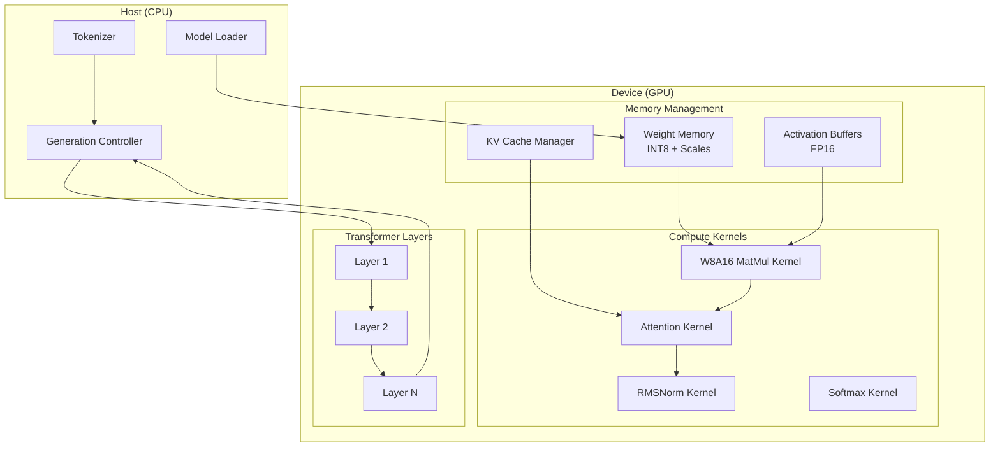
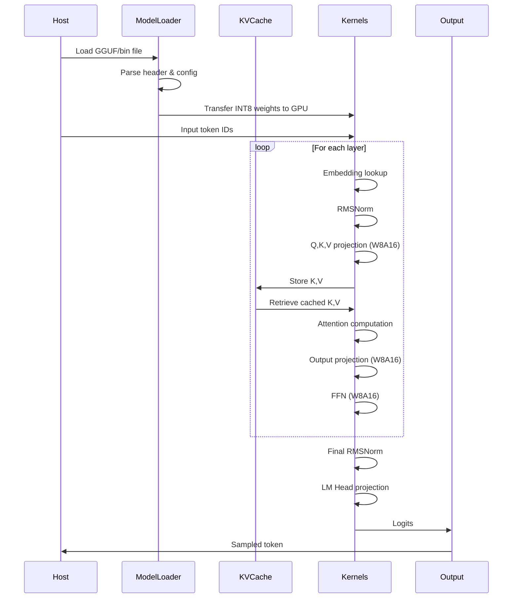

# Design Document: Tiny-LLM Inference Engine

## Overview

本设计文档描述了一个轻量级 LLM 推理引擎的架构和实现细节。该引擎专注于 W8A16 量化推理，使用 CUDA C++ 实现高性能 GPU 计算。核心设计目标是：

1. **显存效率**：通过 INT8 权重量化减少 50% 显存占用
2. **带宽优化**：在 Kernel 内部进行寄存器级反量化，最大化内存带宽利用
3. **计算效率**：使用 Warp Shuffle 和共享内存 tiling 优化计算
4. **可扩展性**：模块化设计支持不同模型架构

## Architecture



### 数据流



## Components and Interfaces

### 1. Model Loader Component

```cpp
// model_loader.h
struct ModelConfig {
    int vocab_size;
    int hidden_dim;
    int num_layers;
    int num_heads;
    int head_dim;
    int intermediate_dim;
    int max_seq_len;
    float rope_theta;
    float rms_norm_eps;
};

struct QuantizedWeight {
    int8_t* data;           // INT8 quantized weights
    half* scales;           // Per-channel or per-group scales
    int rows;
    int cols;
    int group_size;         // Quantization group size (e.g., 128)
};

struct TransformerWeights {
    // Attention weights
    QuantizedWeight wq;     // Query projection
    QuantizedWeight wk;     // Key projection
    QuantizedWeight wv;     // Value projection
    QuantizedWeight wo;     // Output projection
    
    // FFN weights
    QuantizedWeight w1;     // Gate projection
    QuantizedWeight w2;     // Down projection
    QuantizedWeight w3;     // Up projection
    
    // Normalization
    half* rms_att_weight;   // Attention RMSNorm
    half* rms_ffn_weight;   // FFN RMSNorm
};

class ModelLoader {
public:
    // Load model from GGUF format
    static Result<Model> loadGGUF(const std::string& path);
    
    // Load model from binary format
    static Result<Model> loadBin(const std::string& path, const ModelConfig& config);
    
private:
    static Result<ModelConfig> parseGGUFHeader(std::ifstream& file);
    static Result<QuantizedWeight> loadQuantizedTensor(std::ifstream& file, int rows, int cols);
    static void transferToDevice(TransformerWeights& weights);
};
```

### 2. W8A16 Quantized MatMul Kernel

```cpp
// w8a16_matmul.cuh

// Kernel configuration
constexpr int TILE_M = 128;     // Output tile rows
constexpr int TILE_N = 128;     // Output tile cols
constexpr int TILE_K = 32;      // Reduction tile
constexpr int WARP_SIZE = 32;
constexpr int NUM_WARPS = 4;

// Main kernel interface
void w8a16_matmul(
    const half* __restrict__ input,      // [M, K] FP16 activations
    const int8_t* __restrict__ weight,   // [K, N] INT8 weights (column-major)
    const half* __restrict__ scales,     // [N, K/group_size] scale factors
    half* __restrict__ output,           // [M, N] FP16 output
    int M, int N, int K,
    int group_size,
    cudaStream_t stream
);

// Kernel implementation sketch
__global__ void w8a16_matmul_kernel(
    const half* __restrict__ input,
    const int8_t* __restrict__ weight,
    const half* __restrict__ scales,
    half* __restrict__ output,
    int M, int N, int K, int group_size
) {
    // Shared memory for tiling
    __shared__ half smem_input[TILE_M][TILE_K];
    __shared__ int8_t smem_weight[TILE_K][TILE_N];
    __shared__ half smem_scales[TILE_N];
    
    // Thread-local accumulator (FP32 for precision)
    float acc[TILE_M / NUM_WARPS][TILE_N / WARP_SIZE] = {0.0f};
    
    // Tile loop over K dimension
    for (int k_tile = 0; k_tile < K; k_tile += TILE_K) {
        // Cooperative load input tile to shared memory
        // Cooperative load weight tile to shared memory
        // Load scales for current group
        __syncthreads();
        
        // Compute partial products with register-level dequantization
        for (int k = 0; k < TILE_K; k++) {
            // Dequantize: weight_fp16 = (half)weight_int8 * scale
            // Accumulate: acc += input * weight_fp16
        }
        __syncthreads();
    }
    
    // Warp-level reduction using shuffle
    // Write output
}
```

### 3. KV Cache Manager

```cpp
// kv_cache.h

struct KVCacheConfig {
    int num_layers;
    int num_heads;
    int head_dim;
    int max_seq_len;
    int max_batch_size;
};

struct SequenceCache {
    int seq_id;
    int current_len;
    int max_len;
    half* k_cache;  // [num_layers, num_heads, max_len, head_dim]
    half* v_cache;  // [num_layers, num_heads, max_len, head_dim]
};

class KVCacheManager {
public:
    explicit KVCacheManager(const KVCacheConfig& config);
    ~KVCacheManager();
    
    // Allocate cache for a new sequence
    Result<int> allocateSequence(int max_len);
    
    // Release cache for completed sequence
    void releaseSequence(int seq_id);
    
    // Get cache pointers for a sequence at specific layer
    std::pair<half*, half*> getCache(int seq_id, int layer_idx);
    
    // Append new KV pairs
    void appendKV(int seq_id, int layer_idx, 
                  const half* new_k, const half* new_v, int num_tokens);
    
    // Get current sequence length
    int getSeqLen(int seq_id) const;
    
    // Memory statistics
    size_t getUsedMemory() const;
    size_t getTotalMemory() const;
    
private:
    KVCacheConfig config_;
    std::vector<SequenceCache> sequences_;
    half* memory_pool_;
    size_t pool_size_;
    std::vector<bool> slot_used_;
};
```

### 4. Attention Kernel

```cpp
// attention.cuh

// Fused attention with KV cache support
void fused_attention(
    const half* __restrict__ query,      // [batch, num_heads, 1, head_dim]
    const half* __restrict__ k_cache,    // [batch, num_heads, seq_len, head_dim]
    const half* __restrict__ v_cache,    // [batch, num_heads, seq_len, head_dim]
    half* __restrict__ output,           // [batch, num_heads, 1, head_dim]
    const float scale,                   // 1/sqrt(head_dim)
    int batch_size,
    int num_heads,
    int seq_len,
    int head_dim,
    cudaStream_t stream
);

// Attention kernel with causal masking
__global__ void attention_kernel(
    const half* __restrict__ Q,
    const half* __restrict__ K,
    const half* __restrict__ V,
    half* __restrict__ O,
    float scale,
    int seq_len,
    int head_dim
) {
    // Each warp handles one head
    int head_idx = blockIdx.x;
    int lane_id = threadIdx.x % WARP_SIZE;
    
    // Load query vector to registers
    half q_reg[HEAD_DIM / WARP_SIZE];
    
    // Compute attention scores with causal mask
    float scores[MAX_SEQ_LEN];
    for (int pos = 0; pos <= current_pos; pos++) {
        // Dot product Q * K^T using warp shuffle reduction
        float score = 0.0f;
        for (int d = lane_id; d < head_dim; d += WARP_SIZE) {
            score += __half2float(Q[d]) * __half2float(K[pos * head_dim + d]);
        }
        // Warp reduction
        for (int offset = WARP_SIZE / 2; offset > 0; offset /= 2) {
            score += __shfl_down_sync(0xffffffff, score, offset);
        }
        if (lane_id == 0) scores[pos] = score * scale;
    }
    
    // Softmax
    // Weighted sum of V
}
```

### 5. Transformer Layer

```cpp
// transformer.h

class TransformerLayer {
public:
    TransformerLayer(int layer_idx, const TransformerWeights& weights, 
                     const ModelConfig& config);
    
    // Forward pass for single token (decode phase)
    void forward(
        half* hidden_states,     // [batch, hidden_dim]
        KVCacheManager& kv_cache,
        int seq_id,
        int position,
        cudaStream_t stream
    );
    
    // Forward pass for multiple tokens (prefill phase)
    void forwardPrefill(
        half* hidden_states,     // [batch, seq_len, hidden_dim]
        KVCacheManager& kv_cache,
        int seq_id,
        int seq_len,
        cudaStream_t stream
    );
    
private:
    void attention(half* x, half* output, KVCacheManager& kv_cache, 
                   int seq_id, int position, cudaStream_t stream);
    void feedForward(half* x, half* output, cudaStream_t stream);
    void rmsNorm(half* x, half* weight, half* output, int size, cudaStream_t stream);
    
    int layer_idx_;
    const TransformerWeights& weights_;
    const ModelConfig& config_;
    
    // Intermediate buffers
    half* q_buf_;
    half* k_buf_;
    half* v_buf_;
    half* attn_output_;
    half* ffn_intermediate_;
};
```

### 6. Inference Engine

```cpp
// inference_engine.h

struct GenerationConfig {
    int max_new_tokens;
    float temperature;
    int top_k;
    float top_p;
    bool do_sample;
};

class InferenceEngine {
public:
    explicit InferenceEngine(const std::string& model_path);
    ~InferenceEngine();
    
    // Generate text from prompt
    std::vector<int> generate(
        const std::vector<int>& prompt_tokens,
        const GenerationConfig& config
    );
    
    // Get generation statistics
    struct Stats {
        float prefill_time_ms;
        float decode_time_ms;
        int tokens_generated;
        float tokens_per_second;
    };
    Stats getStats() const;
    
private:
    // Prefill phase: process all prompt tokens
    void prefill(const std::vector<int>& tokens, int seq_id);
    
    // Decode phase: generate one token
    int decodeStep(int seq_id, int position, const GenerationConfig& config);
    
    // Sample from logits
    int sample(const half* logits, const GenerationConfig& config);
    
    ModelConfig config_;
    std::vector<TransformerLayer> layers_;
    KVCacheManager kv_cache_;
    
    // Embedding and output weights
    half* token_embedding_;
    QuantizedWeight lm_head_;
    half* final_norm_weight_;
    
    // Buffers
    half* hidden_states_;
    half* logits_;
    
    cudaStream_t compute_stream_;
    Stats stats_;
};
```

## Data Models

### Quantization Format

```cpp
// W8A16 量化格式
// 权重按 group 量化，每个 group 共享一个 scale factor

struct QuantizationParams {
    int group_size = 128;  // 每 128 个元素共享一个 scale
    bool symmetric = true; // 对称量化 (无 zero point)
};

// 量化公式:
// weight_int8 = round(weight_fp32 / scale)
// weight_fp16 = weight_int8 * scale (反量化)

// 内存布局:
// weights: [out_features, in_features] INT8, row-major
// scales:  [out_features, in_features / group_size] FP16
```

### Model File Format (Simplified GGUF)

```cpp
struct GGUFHeader {
    uint32_t magic;           // "GGUF"
    uint32_t version;
    uint64_t tensor_count;
    uint64_t metadata_kv_count;
};

struct TensorInfo {
    std::string name;
    std::vector<int64_t> shape;
    DataType dtype;           // F16, Q8_0, etc.
    uint64_t offset;
};
```

## Correctness Properties

*A property is a characteristic or behavior that should hold true across all valid executions of a system—essentially, a formal statement about what the system should do. Properties serve as the bridge between human-readable specifications and machine-verifiable correctness guarantees.*

### Property 1: W8A16 MatMul Numerical Accuracy

*For any* input activation matrix A (FP16), weight matrix W (INT8), and scale factors S, the W8A16 quantized matrix multiplication result should be within acceptable tolerance (relative error < 1%) of the FP16 baseline computation: `||W8A16(A, W, S) - FP16(A, dequant(W, S))|| / ||FP16(...)|| < 0.01`

**Validates: Requirements 2.5, 2.6**

### Property 2: KV Cache Invariants

*For any* sequence of KV cache operations (allocate, append, release), the following invariants must hold:
- After allocation: cache slots exist with correct dimensions
- After append: cache length increases by the number of appended tokens
- After release: memory is returned to pool and available for reuse
- At all times: total used memory equals sum of all active sequence caches
- When pool is exhausted: allocation returns error before any partial allocation

**Validates: Requirements 3.2, 3.3, 3.4, 3.5, 3.6**

### Property 3: Causal Masking Correctness

*For any* attention computation at position `t`, the attention weights for positions `> t` must be exactly zero, ensuring no information leakage from future tokens.

**Validates: Requirements 4.2**

### Property 4: RMSNorm Output Properties

*For any* input tensor x, the RMSNorm output y should satisfy:
- The root mean square of y equals 1.0 (within floating point tolerance)
- `sqrt(mean(y^2)) ≈ 1.0`

**Validates: Requirements 4.4**

### Property 5: Incremental Decoding Equivalence

*For any* input sequence, the output of incremental decoding (using KV cache) must be identical to full sequence recomputation. Specifically, for a sequence of length N, computing tokens 1..N incrementally should produce the same hidden states as computing all N tokens in a single forward pass.

**Validates: Requirements 4.6**

### Property 6: Greedy Sampling Correctness

*For any* logits tensor, greedy sampling must return the index of the maximum value: `sample_greedy(logits) == argmax(logits)`

**Validates: Requirements 5.2**

### Property 7: Max Generation Length Enforcement

*For any* generation request with max_new_tokens = N, the number of generated tokens must be at most N, regardless of whether EOS is encountered.

**Validates: Requirements 5.4**

### Property 8: Weight-Scale Dimension Consistency

*For any* loaded quantized weight tensor with shape [out_features, in_features] and group_size G, the corresponding scale tensor must have shape [out_features, ceil(in_features / G)].

**Validates: Requirements 1.3, 7.2**

### Property 9: Corrupted File Error Handling

*For any* corrupted or malformed model file (truncated, invalid magic number, wrong version, mismatched dimensions), the Model_Loader must return an error result with a descriptive message, never crash or produce undefined behavior.

**Validates: Requirements 1.5**

## Error Handling

### CUDA Error Handling

```cpp
// cuda_utils.h
#define CUDA_CHECK(call) \
    do { \
        cudaError_t err = call; \
        if (err != cudaSuccess) { \
            throw CudaException(err, __FILE__, __LINE__); \
        } \
    } while(0)

class CudaException : public std::exception {
public:
    CudaException(cudaError_t err, const char* file, int line)
        : error_(err), file_(file), line_(line) {
        message_ = fmt::format("CUDA error {} at {}:{}: {}", 
            static_cast<int>(err), file, line, cudaGetErrorString(err));
    }
    const char* what() const noexcept override { return message_.c_str(); }
    cudaError_t error() const { return error_; }
private:
    cudaError_t error_;
    const char* file_;
    int line_;
    std::string message_;
};
```

### Result Type for Error Propagation

```cpp
// result.h
template<typename T>
class Result {
public:
    static Result<T> ok(T value) { return Result(std::move(value)); }
    static Result<T> err(std::string message) { return Result(std::move(message)); }
    
    bool isOk() const { return std::holds_alternative<T>(data_); }
    bool isErr() const { return !isOk(); }
    
    T& value() { return std::get<T>(data_); }
    const T& value() const { return std::get<T>(data_); }
    const std::string& error() const { return std::get<std::string>(data_); }
    
private:
    Result(T value) : data_(std::move(value)) {}
    Result(std::string error) : data_(std::move(error)) {}
    std::variant<T, std::string> data_;
};
```

### Error Categories

| Category | Examples | Handling Strategy |
|----------|----------|-------------------|
| File I/O | File not found, read error | Return Result::err with description |
| Format | Invalid GGUF magic, version mismatch | Return Result::err with details |
| Dimension | Weight shape mismatch | Return Result::err with expected vs actual |
| Memory | GPU OOM, allocation failure | Return Result::err with memory stats |
| CUDA | Kernel launch failure, sync error | Throw CudaException |

## Testing Strategy

### Unit Tests

Unit tests verify specific examples and edge cases:

1. **Model Loader Tests**
   - Load valid GGUF file and verify config extraction
   - Load valid bin file with known weights
   - Verify error on corrupted file header
   - Verify error on truncated file

2. **KV Cache Tests**
   - Allocate and release single sequence
   - Allocate multiple concurrent sequences
   - Verify error on pool exhaustion
   - Verify memory reclamation after release

3. **Kernel Tests**
   - Small matrix multiplication correctness
   - Edge cases: M=1, N=1, K=1
   - Non-aligned dimensions

### Property-Based Tests

Property-based tests verify universal properties across many generated inputs. Each test runs minimum 100 iterations.

**Testing Framework**: Google Test with custom property testing utilities (or integrate with RapidCheck for C++)

1. **Property 1 Test: W8A16 Numerical Accuracy**
   - Generate random FP16 activations [M, K] where M ∈ [1, 256], K ∈ [64, 2048]
   - Generate random INT8 weights [K, N] where N ∈ [64, 2048]
   - Generate random FP16 scales
   - Compare W8A16 result with FP16 baseline
   - **Tag: Feature: tiny-llm-inference-engine, Property 1: W8A16 MatMul Numerical Accuracy**

2. **Property 2 Test: KV Cache Invariants**
   - Generate random sequence of operations: allocate, append, release
   - Verify invariants after each operation
   - **Tag: Feature: tiny-llm-inference-engine, Property 2: KV Cache Invariants**

3. **Property 3 Test: Causal Masking**
   - Generate random Q, K, V tensors with random sequence lengths
   - Verify attention weights are zero for future positions
   - **Tag: Feature: tiny-llm-inference-engine, Property 3: Causal Masking Correctness**

4. **Property 4 Test: RMSNorm Output**
   - Generate random input tensors
   - Verify RMS of output ≈ 1.0
   - **Tag: Feature: tiny-llm-inference-engine, Property 4: RMSNorm Output Properties**

5. **Property 5 Test: Incremental Decoding Equivalence**
   - Generate random model weights and input sequences
   - Compare incremental vs full computation
   - **Tag: Feature: tiny-llm-inference-engine, Property 5: Incremental Decoding Equivalence**

6. **Property 6 Test: Greedy Sampling**
   - Generate random logits tensors
   - Verify sample equals argmax
   - **Tag: Feature: tiny-llm-inference-engine, Property 6: Greedy Sampling Correctness**

7. **Property 7 Test: Max Generation Length**
   - Generate random prompts and max_new_tokens values
   - Verify output length ≤ max_new_tokens
   - **Tag: Feature: tiny-llm-inference-engine, Property 7: Max Generation Length Enforcement**

8. **Property 8 Test: Weight-Scale Dimensions**
   - Generate random weight shapes and group sizes
   - Verify scale tensor has correct shape
   - **Tag: Feature: tiny-llm-inference-engine, Property 8: Weight-Scale Dimension Consistency**

9. **Property 9 Test: Corrupted File Handling**
   - Generate various corrupted file patterns
   - Verify error result is returned, no crash
   - **Tag: Feature: tiny-llm-inference-engine, Property 9: Corrupted File Error Handling**

### Integration Tests

1. **End-to-End Inference Test**
   - Load a small test model (e.g., tiny Llama with 1-2 layers)
   - Run inference on known prompts
   - Verify output matches reference implementation

2. **Performance Benchmark**
   - Measure tokens/second for various batch sizes
   - Compare memory usage: W8A16 vs FP16

