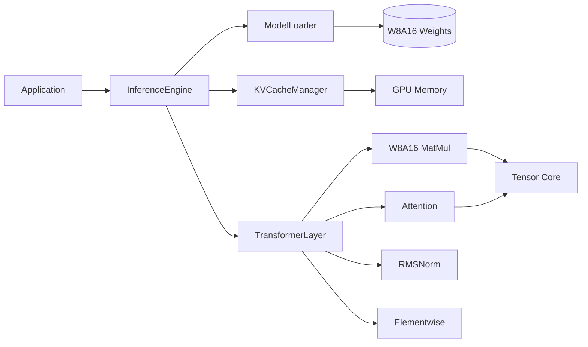

# Tiny-LLM Inference Engine

> A lightweight, high-performance CUDA C++ inference engine for Transformer models.

[](https://github.com/LessUp/tiny-llm/actions/workflows/ci.yml)
[](https://lessup.github.io/tiny-llm/)
[](https://github.com/LessUp/tiny-llm/releases)
[](LICENSE)


[English](README.md) • [简体中文](README.zh-CN.md) • [Documentation](https://lessup.github.io/tiny-llm/) • [API Reference](https://lessup.github.io/tiny-llm/docs/en/API)

---

## 🎯 Overview

Tiny-LLM is a **high-performance CUDA C++ inference engine** designed for efficient Transformer model deployment on NVIDIA GPUs. It delivers production-ready inference with:

- **~50% memory reduction** via W8A16 quantization (INT8 weights + FP16 activations)
- **Efficient KV Cache** management for long-context generation
- **Optimized CUDA kernels** with Tensor Core support
- **Zero dependencies** — pure CUDA C++ with no external runtime

Built for developers who need **fast, predictable, and portable** LLM inference without the overhead of heavy frameworks.

---

## ✨ Features

| Feature | Description | Status |
|---------|-------------|--------|
| **W8A16 Quantization** | INT8 weights + FP16 activations for ~50% memory reduction | ✅ Stable |
| **KV Cache Management** | Efficient incremental decoding with sequence management | ✅ Stable |
| **Optimized CUDA Kernels** | Tensor Core INT8, shared memory tiling, warp shuffle reductions | ✅ Stable |
| **Multi-Sampling Strategies** | Greedy, Temperature, Top-k, Top-p (nucleus) decoding | ✅ Stable |
| **Result<T> Error Handling** | Monadic error handling — no exceptions for control flow | ✅ Stable |
| **Comprehensive Testing** | GoogleTest unit tests + RapidCheck property-based tests | ✅ Stable |
| **Bilingual Documentation** | Full documentation in English and Chinese | ✅ Complete |

### Roadmap

| Feature | Status | Target |
|---------|--------|--------|
| GGUF Runtime Loading | 🚧 In Progress | v2.1 |
| PagedAttention | 📋 Planned | v2.2 |
| Speculative Decoding | 🔬 Research | v2.3 |
| FP8 Support | 🔬 Research | v3.0 |
| Multi-GPU Parallelism | 📋 Planned | v3.0 |

---

## ⚡ Performance

Benchmarked on **NVIDIA A100-80GB** (SM 8.0), CUDA 12.4:

| Model | Batch Size | Tokens/sec | Memory Usage | Speedup vs FP16 |
|-------|-----------|------------|--------------|-----------------|
| LLaMA-7B | 1 | ~45 t/s | ~3.5 GB | **1.8x** |
| LLaMA-7B | 4 | ~120 t/s | ~12 GB | **1.6x** |
| LLaMA-13B | 1 | ~25 t/s | ~6.5 GB | **1.7x** |

> Full benchmarks with different configurations: [Benchmarks](https://lessup.github.io/tiny-llm/docs/en/BENCHMARKS)

---

## 🚀 Quick Start

### Requirements

| Component | Minimum | Recommended |
|-----------|---------|-------------|
| NVIDIA GPU | SM 7.0 (Volta) | SM 8.0+ (Ampere+) |
| CUDA Toolkit | 11.0 | 12.0+ |
| CMake | 3.18 | 3.25+ |
| C++ Compiler | GCC 9+ / Clang 10+ | GCC 11+ |

### Build from Source

```bash
# Clone and build
git clone https://github.com/LessUp/tiny-llm.git
cd tiny-llm
mkdir build && cd build
cmake .. -DCMAKE_BUILD_TYPE=Release
make -j$(nproc)

# Run tests
ctest --output-on-failure
```

### Usage Example

```cpp
#include <tiny_llm/inference_engine.h>

int main() {
    // Configure model
    ModelConfig config;
    config.vocab_size = 32000;
    config.hidden_dim = 4096;
    config.num_layers = 32;

    // Load model with W8A16 weights
    auto engine = InferenceEngine::load("model.bin", config).value();

    // Generate text
    GenerationConfig gen;
    gen.max_new_tokens = 256;
    gen.temperature = 0.7f;
    gen.top_p = 0.9f;

    auto output = engine.generate({1, 15043, 29892}, gen);
    for (int token : output.tokens) {
        std::cout << tokenizer.decode(token);
    }
}
```

---

## 🏗️ Architecture



### Core Components

| Component | Responsibility |
|-----------|---------------|
| **InferenceEngine** | Main entry point — orchestrates loading, generation, and sampling |
| **ModelLoader** | Loads quantized weights from binary format to GPU memory |
| **KVCacheManager** | Manages key-value cache with sequence allocation and eviction |
| **TransformerLayer** | Forward pass through a single transformer layer |
| **W8A16 MatMul** | Quantized matrix multiplication using INT8 × FP16 |

---

## 📁 Project Structure

```
tiny-llm/
├── website/               # GitHub Pages site (Jekyll)
│   ├── docs/              # Documentation (EN/ZH)
│   ├── changelog/         # Version history
│   ├── assets/            # CSS, JS, images
│   └── _config.yml        # Jekyll configuration
├── specs/                 # Spec-driven development documents
│   ├── product/           # Feature requirements
│   ├── rfc/               # Architecture decisions
│   ├── api/               # API definitions
│   └── testing/           # BDD test specifications
├── include/tiny_llm/      # Public headers
├── kernels/               # CUDA kernels (.cu, .cuh)
├── src/                   # Host-side implementation (.cpp)
├── tests/                 # Unit & property-based tests
├── CMakeLists.txt         # Build configuration
└── README.md              # This file
```

---

## 🔌 GPU Support

| Architecture | Compute Capability | Status | Notes |
|--------------|-------------------|--------|-------|
| Volta | SM 7.0, 7.5 | ✅ Supported | Tensor Core INT8 available |
| Turing | SM 7.5 | ✅ Supported | Improved INT8 performance |
| Ampere | SM 8.0, 8.6 | ✅ Optimized | Best performance |
| Ada Lovelace | SM 8.9 | ✅ Optimized | Full feature support |
| Hopper | SM 9.0 | ✅ Supported | FP8 ready |

---

## 🤝 Contributing

We welcome contributions! Tiny-LLM follows **Spec-Driven Development** — specs come before code.

### Quick Start

```bash
# Fork and clone
git clone https://github.com/your-username/tiny-llm.git
cd tiny-llm

# Build with tests
mkdir build && cd build
cmake .. -DCMAKE_BUILD_TYPE=Debug -DBUILD_TESTS=ON
make -j$(nproc)

# Run checks
ctest --output-on-failure
```

### Ways to Contribute

| Type | How |
|------|-----|
| 🐛 **Bug Reports** | [Open an Issue](https://github.com/LessUp/tiny-llm/issues) with reproduction steps |
| 💡 **Feature Requests** | [Start a Discussion](https://github.com/LessUp/tiny-llm/discussions) |
| 🔧 **Code Contributions** | Fork → Branch → PR (follow [CONTRIBUTING.md](CONTRIBUTING.md)) |
| 📝 **Documentation** | Improve docs in `website/docs/` |
| 🧪 **Testing** | Add unit tests or property-based tests |

---

## 📜 License

This project is licensed under the [MIT License](LICENSE).

---

## 🙏 Acknowledgments

- Inspired by [llama.cpp](https://github.com/ggerganov/llama.cpp) and [vLLM](https://github.com/vllm-project/vllm)
- Testing with [GoogleTest](https://github.com/google/googletest) and [RapidCheck](https://github.com/emil-e/rapidcheck)
- Built with ❤️ by the [Tiny-LLM contributors](https://github.com/LessUp/tiny-llm/graphs/contributors)

---

<p align="center">
  <a href="https://lessup.github.io/tiny-llm/">📖 Documentation</a> •
  <a href="https://github.com/LessUp/tiny-llm/releases">📦 Releases</a> •
  <a href="https://github.com/LessUp/tiny-llm/issues">🐛 Issues</a> •
  <a href="https://github.com/LessUp/tiny-llm/discussions">💬 Discussions</a>
</p>

<p align="center">
  <em>Made with ❤️ by the Tiny-LLM team</em>
</p>
