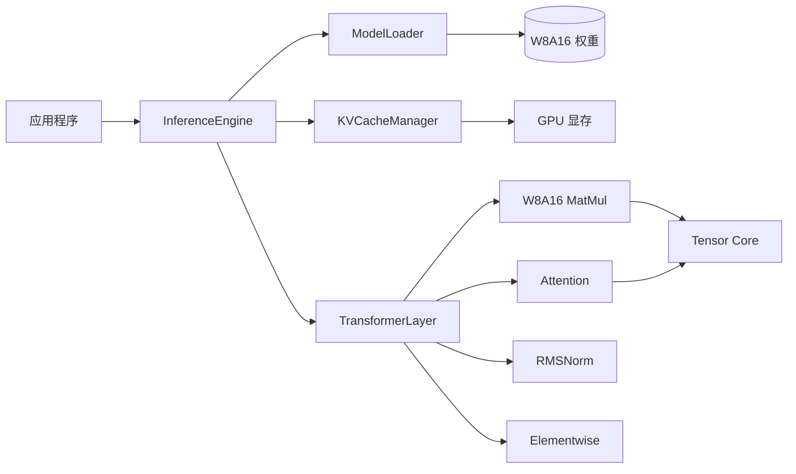

# Tiny-LLM 推理引擎

> 轻量级、高性能 CUDA C++ Transformer 模型推理引擎。

[](https://github.com/LessUp/tiny-llm/actions/workflows/ci.yml)
[](https://lessup.github.io/tiny-llm/)
[](https://github.com/LessUp/tiny-llm/releases)
[](LICENSE)


[English](README.md) • 简体中文 • [文档](https://lessup.github.io/tiny-llm/) • [API 参考](https://lessup.github.io/tiny-llm/docs/zh/API)

---

## 🎯 概述

Tiny-LLM 是一个为 NVIDIA GPU 设计的高性能 CUDA C++ 推理引擎，专注于高效的 Transformer 模型部署：

- **显存减少 ~50%** — 通过 W8A16 量化（INT8 权重 + FP16 激活）
- **高效 KV 缓存** — 支持长文本生成的缓存管理
- **优化的 CUDA Kernel** — 支持 Tensor Core
- **零运行时依赖** — 纯 CUDA C++，无需重型框架

为需要**快速、可预测、可移植** LLM 推理的开发者而打造。

---

## ✨ 核心特性

| 特性 | 说明 | 状态 |
|---------|-------------|--------|
| **W8A16 量化** | INT8 权重 + FP16 激活，显存减少约 50% | ✅ 稳定 |
| **KV 缓存管理** | 高效的增量解码与序列管理 | ✅ 稳定 |
| **优化 CUDA Kernel** | Tensor Core INT8、共享内存 tiling、warp shuffle | ✅ 稳定 |
| **多采样策略** | 贪婪、温度、Top-k、Top-p (核) 解码 | ✅ 稳定 |
| **Result<T> 错误处理** | 单子错误处理 — 不用异常控制流 | ✅ 稳定 |
| **完整测试** | GoogleTest 单元测试 + RapidCheck 基于属性的测试 | ✅ 稳定 |
| **双语文档** | 完整的中英文文档 | ✅ 完成 |

### 路线图

| 特性 | 状态 | 目标版本 |
|---------|--------|--------|
| GGUF 运行时加载 | 🚧 进行中 | v2.1 |
| PagedAttention | 📋 计划中 | v2.2 |
| 投机解码 | 🔬 研究中 | v2.3 |
| FP8 支持 | 🔬 研究中 | v3.0 |
| 多 GPU 并行 | 📋 计划中 | v3.0 |

---

## ⚡ 性能

基于 **NVIDIA A100-80GB** (SM 8.0)，CUDA 12.4 测试：

| 模型 | 批大小 | Tokens/秒 | 显存使用 | 相比 FP16 加速 |
|-------|-----------|------------|--------------|-----------------|
| LLaMA-7B | 1 | ~45 t/s | ~3.5 GB | **1.8x** |
| LLaMA-7B | 4 | ~120 t/s | ~12 GB | **1.6x** |
| LLaMA-13B | 1 | ~25 t/s | ~6.5 GB | **1.7x** |

> 完整性能基准测试：[性能基准](https://lessup.github.io/tiny-llm/docs/zh/BENCHMARKS)

---

## 🚀 快速开始

### 系统要求

| 组件 | 最低配置 | 推荐配置 |
|-----------|---------|-------------|
| NVIDIA GPU | SM 7.0 (Volta) | SM 8.0+ (Ampere+) |
| CUDA Toolkit | 11.0 | 12.0+ |
| CMake | 3.18 | 3.25+ |
| C++ 编译器 | GCC 9+ / Clang 10+ | GCC 11+ |

### 从源码构建

```bash
# 克隆并构建
git clone https://github.com/LessUp/tiny-llm.git
cd tiny-llm
mkdir build && cd build
cmake .. -DCMAKE_BUILD_TYPE=Release
make -j$(nproc)

# 运行测试
ctest --output-on-failure
```

### 使用示例

```cpp
#include <tiny_llm/inference_engine.h>

int main() {
    // 配置模型
    ModelConfig config;
    config.vocab_size = 32000;
    config.hidden_dim = 4096;
    config.num_layers = 32;

    // 加载 W8A16 权重
    auto engine = InferenceEngine::load("model.bin", config).value();

    // 生成文本
    GenerationConfig gen;
    gen.max_new_tokens = 256;
    gen.temperature = 0.7f;
    gen.top_p = 0.9f;

    auto output = engine.generate({1, 15043, 29892}, gen);
    for (int token : output.tokens) {
        std::cout << tokenizer.decode(token);
    }
}
```

---

## 🏗️ 架构



### 核心组件

| 组件 | 职责 |
|-----------|---------------|
| **InferenceEngine** | 主入口 — 协调加载、生成和采样 |
| **ModelLoader** | 将量化权重从二进制格式加载到 GPU 显存 |
| **KVCacheManager** | 管理键值缓存，支持序列分配和驱逐 |
| **TransformerLayer** | 单个 Transformer 层的前向传播 |
| **W8A16 MatMul** | 使用 INT8 × FP16 的量化矩阵乘法 |

---

## 📁 项目结构

```
tiny-llm/
├── website/               # GitHub Pages 网站 (Jekyll)
│   ├── docs/              # 文档 (中英)
│   ├── changelog/         # 版本历史
│   ├── assets/            # CSS, JS, 图片
│   └── _config.yml        # Jekyll 配置
├── specs/                 # 规范驱动开发文档
│   ├── product/           # 功能需求
│   ├── rfc/               # 架构决策
│   ├── api/               # API 定义
│   └── testing/           # BDD 测试规范
├── include/tiny_llm/      # 公共头文件
├── kernels/               # CUDA kernels (.cu, .cuh)
├── src/                   # 主机端实现 (.cpp)
├── tests/                 # 单元测试和属性测试
├── CMakeLists.txt         # 构建配置
└── README.md              # 本文件
```

---

## 🔌 GPU 支持

| 架构 | 计算能力 | 状态 | 说明 |
|--------------|-------------------|--------|-------|
| Volta | SM 7.0, 7.5 | ✅ 支持 | 可用 Tensor Core INT8 |
| Turing | SM 7.5 | ✅ 支持 | 改进的 INT8 性能 |
| Ampere | SM 8.0, 8.6 | ✅ 优化 | 最佳性能 |
| Ada Lovelace | SM 8.9 | ✅ 优化 | 完整功能支持 |
| Hopper | SM 9.0 | ✅ 支持 | FP8 就绪 |

---

## 🤝 贡献

我们欢迎贡献！Tiny-LLM 遵循**规范驱动开发** — 规范先于代码。

### 快速开始

```bash
# Fork 并克隆
git clone https://github.com/your-username/tiny-llm.git
cd tiny-llm

# 构建（含测试）
mkdir build && cd build
cmake .. -DCMAKE_BUILD_TYPE=Debug -DBUILD_TESTS=ON
make -j$(nproc)

# 运行检查
ctest --output-on-failure
```

### 贡献方式

| 类型 | 方式 |
|------|-----|
| 🐛 **Bug 报告** | [提交 Issue](https://github.com/LessUp/tiny-llm/issues)，附复现步骤 |
| 💡 **功能请求** | [发起讨论](https://github.com/LessUp/tiny-llm/discussions) |
| 🔧 **代码贡献** | Fork → 分支 → PR (遵循 [CONTRIBUTING.md](CONTRIBUTING.md)) |
| 📝 **文档改进** | 完善 `website/docs/` 中的文档 |
| 🧪 **测试补充** | 添加单元测试或基于属性的测试 |

---

## 📜 许可证

本项目采用 [MIT 许可证](LICENSE)。

---

## 🙏 致谢

- 灵感来源于 [llama.cpp](https://github.com/ggerganov/llama.cpp) 和 [vLLM](https://github.com/vllm-project/vllm)
- 测试使用 [GoogleTest](https://github.com/google/googletest) 和 [RapidCheck](https://github.com/emil-e/rapidcheck)
- 由 [Tiny-LLM 贡献者们](https://github.com/LessUp/tiny-llm/graphs/contributors) 用 ❤️ 打造

---

<p align="center">
  <a href="https://lessup.github.io/tiny-llm/">📖 文档</a> •
  <a href="https://github.com/LessUp/tiny-llm/releases">📦 发布</a> •
  <a href="https://github.com/LessUp/tiny-llm/issues">🐛 问题</a> •
  <a href="https://github.com/LessUp/tiny-llm/discussions">💬 讨论</a>
</p>

<p align="center">
  <em>由 Tiny-LLM 团队用 ❤️ 制作</em>
</p>
